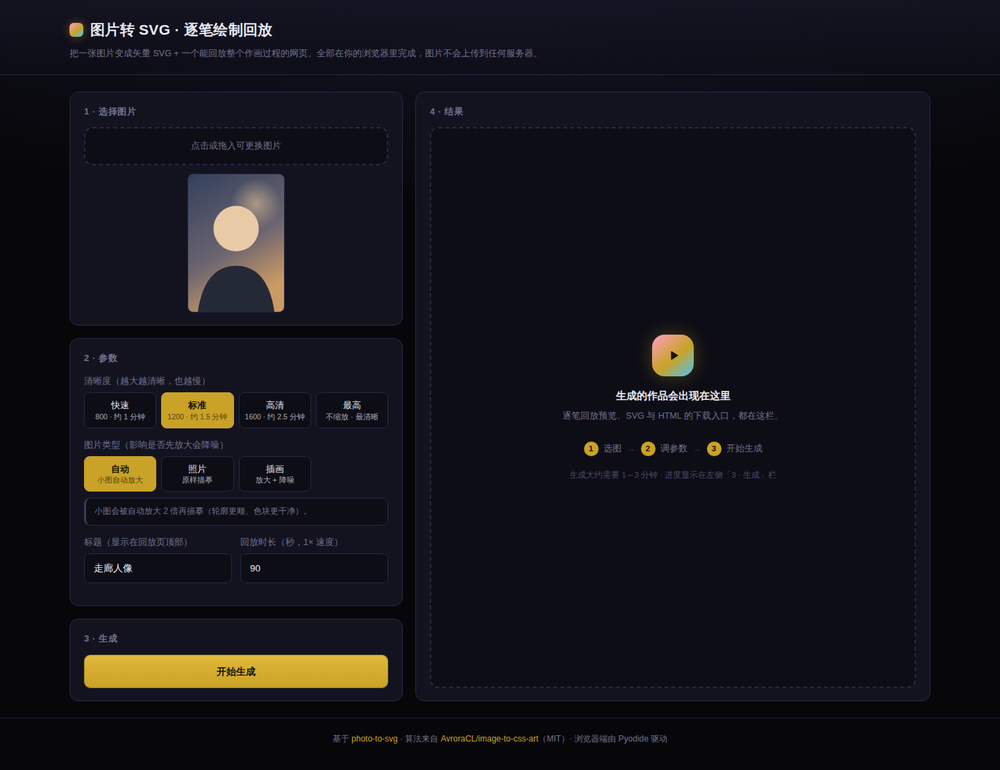
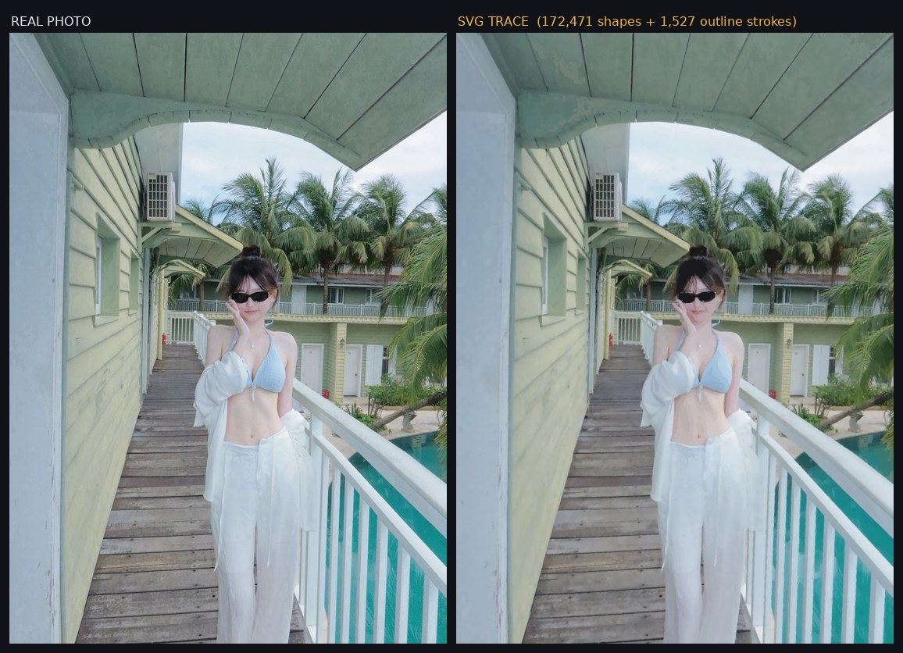
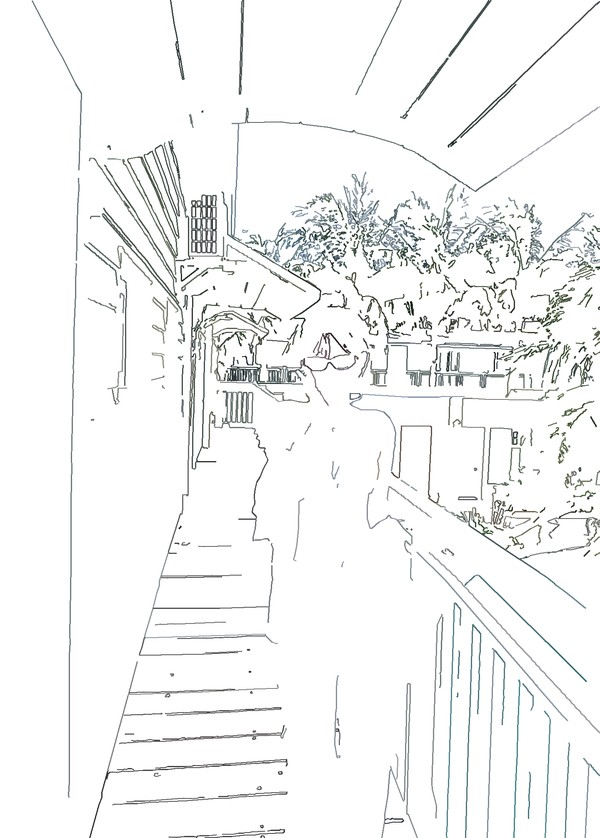

<h1 align="center">photo-to-svg</h1>

把一张照片变成**逐笔绘制的 SVG 矢量插画**，并生成一个能回放整个作画过程的网页。

<div align="center">

### ▶ [在线直接用 → vanemkrau.github.io/photo-to-svg](https://vanemkrau.github.io/photo-to-svg/)

拖一张图进去就出 SVG 和回放网页 · 无需安装 · **图片不上传**（全在你浏览器里算）



</div>

---

不是简单的"图片转矢量"——它模拟人的作画顺序：**先勾线稿 → 再铺大色块 → 最后抠细节**，
每一步都按"视觉重量"分配时间，大笔慢慢铺、小笔快带过，像看一段绘画录像。

> 建立在 [**AvroraCL/image-to-css-art**](https://github.com/AvroraCL/image-to-css-art)（MIT）之上。
> 上游提供算法管线与本 skill 本体，本项目在此之上加了 SVG 输出与完整回放页。
> 详见 [`ATTRIBUTION.md`](ATTRIBUTION.md)。

```
   真实照片                              SVG 描摹（172,471 个色块 + 1,527 笔线稿）
┌──────────────────┐                  ┌──────────────────┐
│                  │                  │                  │
│   走廊人像        │   ──────────►    │   纯矢量，无位图   │
│   1440 × 2012    │                  │   DOM 里只有 1 个  │
│                  │                  │   <canvas>       │
└──────────────────┘                  └──────────────────┘
```



线稿阶段（起稿时只勾结构，天空云彩一笔不落）：



---

## 网页版（浏览器里直接用，无需安装）

**在线使用：https://vanemkrau.github.io/photo-to-svg/**

打开网页 → 拖一张图片进去 → 等一会儿 → 下载 SVG 和回放页。

- **图片不上传**：整个流水线跑在你自己的浏览器里（Pyodide 把 CPython + OpenCV 编译成 WebAssembly）
- **无需安装**：第一次打开要下载约 30 MB 运行时，之后走浏览器缓存
- **耗时参考**（实测，取决于设备）：

  | 档位 | 长边 | 耗时 | 产物大小 |
  |---|---|---|---|
  | 快速 | 800 | 约 1 分钟 | SVG 几 MB |
  | 标准 | 1200 | 约 1.5 分钟 | SVG 16 MB / HTML 7 MB |
  | 高清 | 1600 | 约 2.5 分钟 | — |
  | 原始 | 不缩放 | 3 分钟起 | SVG 32 MB / HTML 13 MB（1440×2012 实拍） |

  手机建议选「标准」及以下；超大图可能因浏览器内存不足失败。

### 质量与命令行一致吗

**一致，而且默认更好。** 网页版跑的是仓库里**同一份 Python 脚本**（`tools/` + `skill/scripts/`），
没有另写 JS 实现。实测同一张图（统一缩到原尺寸比较）：

| 配置 | SSIM | MAE |
|---|---|---|
| 命令行 · 无预处理 | 0.9035 | 4.203 |
| 网页版 · 无预处理 | 0.8990 | 4.331 |
| **网页版 · 默认（自动预处理）** | **0.9485** | **2.945** |

- **平台差异只有 0.0045**（OpenCV 4.11 vs 5.0.0 的实现细节），肉眼不可辨
- 网页版默认开了「小图自动放大 2 倍」，所以默认质量**比命令行默认高 0.045**

详见 [`docs/参数速查.md`](docs/参数速查.md#网页版-vs-命令行质量一样吗)。

---

## 快速开始


```bash
git clone https://github.com/VanemKrAu/photo-to-svg.git
cd photo-to-svg
bash install.sh                       # 约 1 分钟，装依赖 + 自动自检
```

装完想再确认一遍能不能用（会真跑一张小图，约 40 秒）：

```bash
.venv/bin/python tools/smoke_test.py --render
```

然后一条命令出全套：

```bash
.venv/bin/python tools/make_art.py <你的照片> 作品名 "标题" 90 0.15 0.25 2.6
```

70 秒后，`output/作品名/` 下会得到三个文件：

| 文件 | 大小 | 用途 |
|---|---|---|
| `作品名.svg` | 十几~几十 MB | 矢量原图，无限放大不糊，电脑上看 |
| `作品名.html` | 十几 MB | **逐笔回放页**，手机/电脑直接打开 |
| `作品名.json` | 1 KB | 本次参数报告 |

> **注意**：SVG 和 HTML 都很大，**别用 GitHub 网页界面直接打开**（会卡）。
> 下载到本地再打开。

---

## 回放页有什么

- **离散回放**——每帧直接跳变，没有任何补间动画，贴合绘画录像的观感
- **播放 / 暂停 / 重播 / 0.5–4× 倍速 / 进度条拖动**
- **真线稿层**——从原图 Canny 边缘提取并追踪成有序折线，用描边画出来（不是填充色块）
- **宽屏并排**——窗口 ≥1000px 自动分左右两栏：左边绘制中、右边同步原图
- **对照原图**——窄屏下手指拖动分界线，鼠标悬停也能对比
- **PC 适配**——hover 反馈、键盘快捷键（`空格` `←` `→` `Home` `End` `F`）、双击全屏
- **缩放**——滚轮 / 双指捏合 / `＋` `−` 按钮缩放（最高 24×），放大后拖动平移，
  双击画面在 1× ⇄ 2.5× 间切换，`0` 适应窗口、`1` 实际大小。
  实现上只给 `<canvas>` 套 CSS `transform`，不重绘，所以放到 2400% 也不掉帧

---

## 装成 Agent Skill（可选）

`skill/` 是上游 skill 的原样副本 + 本项目的 SVG 扩展，可以直接丢给 AI 助手用：

```bash
# Claude Code
cp -r skill ~/.claude/skills/image-to-css-art

# 通用 skills 目录
cp -r skill ~/.agents/skills/image-to-css-art
```

装好后，你说「把这张图转成 SVG」，助手就会读到 `skill/SKILL.md` 和
`AGENTS.md` 里的规则，按既定流程执行。

> **两个产物形态怎么选**
>
> | 需求 | 用什么 |
> |---|---|
> | 纯 HTML + CSS、有资源限制（禁 img/svg/script/base64/外链） | 上游原版 `skill/scripts/image_to_css.py` |
> | 要矢量 `.svg` 文件、或想看绘制过程回放 | 本项目 `tools/make_art.py` |

---

## 实测数据

| 作品 | 尺寸 | 形状数 | 线稿笔 | SVG | HTML | SSIM |
|---|---|---|---|---|---|---|
| 海边人像 | 1440×2162 | 182,640 | 2,310 | 46.9 MB | 13.5 MB | **0.9434** |
| 走廊人像 | 1440×2012 | 172,471 | 1,527 | 31.1 MB | 13.4 MB | 0.9154 |
| 夜景人像 | 1440×1912 | 13,255 | — | 4.1 MB | 4.8 MB | 前景 MAE 0.386 |
| 动漫三人组 | 1667×943 | 25,729 | — | 7.0 MB | 8.5 MB | — |

**保真度天花板**：照片纹理矢量化之后必然变成色块，SSIM 大约卡在 **0.92~0.94**，
结构越"硬"、线条越多的图越低。想更接近照片只能堆笔数/分辨率，换不来「照片感」。

---

## 技术要点

- **纯矢量输出**：`<path fill=… fill-rule="evenodd">` + 局部拟合的 `linearGradient`，
  没有位图、没有 base64 图片、没有外部依赖
- **Canvas 回放**：DOM 里只有 1 个 `<canvas>`，笔数据打包成二进制（TypedArray 零拷贝），
  逐帧**增量**绘制。18 万笔也能在手机上流畅播放
- **时间轴按视觉重量分配**：`权重 = 0.15 + bbox面积 × 0.002`，
  累计权重表 + 二分查找做「时间 ↔ 笔序号」双向映射
- **大色块扫描线切分**：画面 75% 的面积在前 1.94% 的笔里铺完，
  所以大色块会被切成横条，像大笔刷一横条一横条刷上去
- **零外部依赖的网页**：不加载任何框架、字体、CDN

---

## 文档

| 文件 | 内容 |
|---|---|
| [`ATTRIBUTION.md`](ATTRIBUTION.md) | **出处、上游项目、许可** |
| [`docs/原理与流程.md`](docs/原理与流程.md) | 整条流水线怎么走的、数据格式、关键设计 |
| [`docs/参数速查.md`](docs/参数速查.md) | 每个参数怎么选、不同图类型的经验值 |
| [`docs/踩坑记录.md`](docs/踩坑记录.md) | **15 个真实踩过的坑**及修法（改代码前必读） |
| [`AGENTS.md`](AGENTS.md) | 给 AI 助手的操作规则（让它直接照做） |
| [`SETUP.md`](SETUP.md) | 换设备 / 换系统的详细安装步骤 |

---

## 目录结构

```
photo-to-svg/
├── install.sh              一键安装
├── requirements.txt
├── skill/                  ★ 上游 skill 原样副本（MIT）+ 本项目 extras
│   ├── SKILL.md
│   ├── LICENSE             上游 MIT 许可（分发时请保留）
│   ├── scripts/            上游原版：CSS clip-path 输出
│   ├── references/         上游参数调优文档
│   └── extras/             ★ 本项目新增：SVG 输出 + Canvas 回放页 + 保真度校验
├── tools/                  ★ 本项目新增：完整流水线
│   ├── make_art.py         入口（串联全流程 + 尺寸自检）
│   ├── build_svg_art.py    描摹核心（与 skill/extras/ 同一份）
│   ├── svg2canvas.py       SVG → Canvas 回放页（与 skill/extras/ 同一份）
│   ├── verify_svg.py       保真度校验（与 skill/extras/ 同一份）
│   ├── smoke_test.py       一条命令自检（依赖/语法/同步/链接/实跑）
│   └── secret_scan.py      推送前密钥自检
├── web/                    ★ 网页版（GitHub Pages）
│   ├── index.html          界面
│   ├── worker.js           Web Worker：加载 Pyodide、跑流水线
│   └── web_run.py          浏览器端驱动（不走 subprocess，直接调模块）
├── docs/                   文档
├── examples/               示例图
├── .github/workflows/      发布网页版到 Pages
└── output/                 产物（已 gitignore）
```

---

## 致谢

- **[AvroraCL/image-to-css-art](https://github.com/AvroraCL/image-to-css-art)** —— 算法管线与 skill 本体，MIT 许可
- 本项目的 SVG 输出、Canvas 回放页、时间轴设计、以及那 12 条踩坑记录，都是在它之上做的

## 许可

MIT。`skill/` 下的上游代码版权归 AvroraCL（见 `skill/LICENSE`），分发时请保留该文件。
